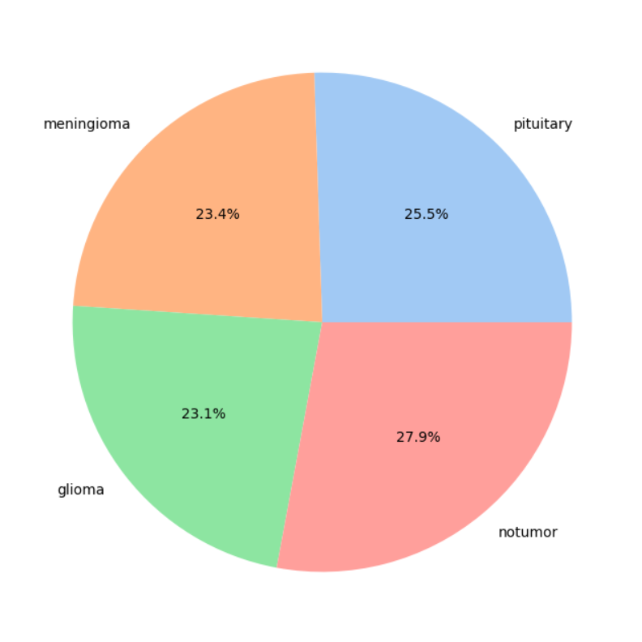
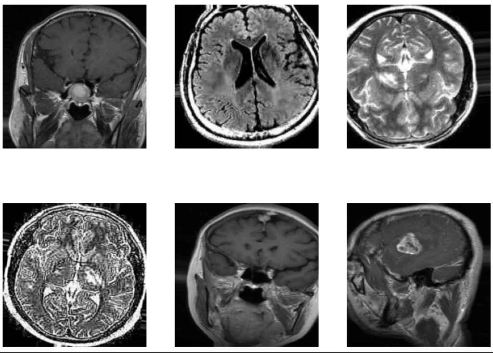
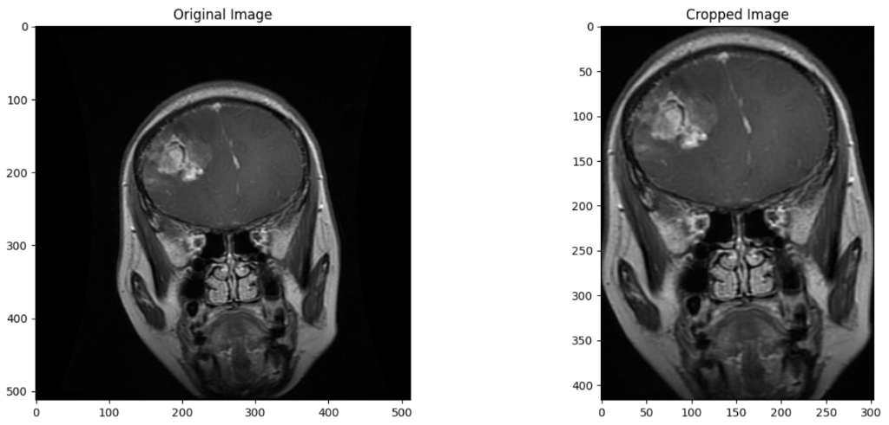
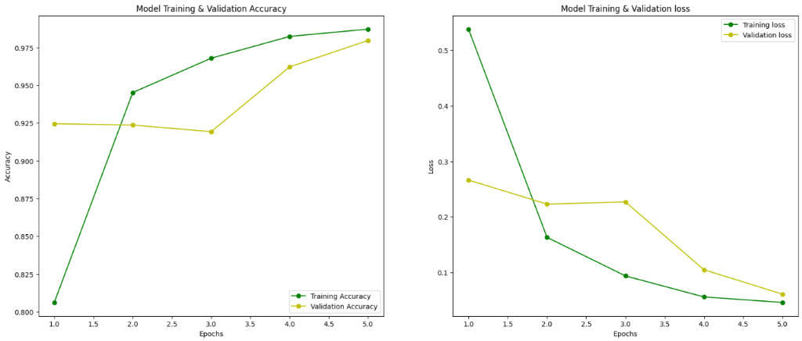
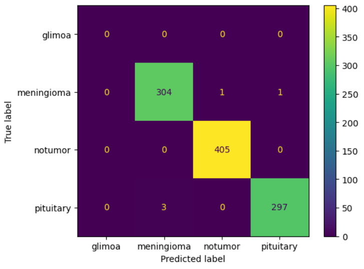

# BrainScan AI: High-Performance Tumor Classification

**An advanced deep learning framework for precise Brain Tumor detection, featuring state-of-the-art Model Explainability (Grad-CAM).**

[Overview](#-overview) • [Dataset Insight](#-dataset-insight) • [Preprocessing](#%EF%B8%8F-preprocessing) • [Performance Metrics](#-performance-metrics) • [Quick Start](#-quick-start)

---

##  Overview

**BrainScan AI** is designed to assist medical professionals by providing rapid, AI-driven preliminary scans of MRI data. Our system doesn't just predict; it **explains**. By integrating **Grad-CAM (Gradient-weighted Class Activation Mapping)**, the model highlights the specific regions in an MRI scan that contributed most to its classification, ensuring transparency and trust in the diagnostic process.

###  Key Features
- **Multi-Class Detection**: Accurate classification of **Glioma**, **Meningioma**, and **Pituitary** tumors, or **No Tumor**.
- **Explainable Insights**: Real-time heatmap generation to visualize tumor localization.
- **Dual Pipeline**: Optimized implementations in both **PyTorch** (Inference) and **TensorFlow** (Robust Training).
- **Interactive UI**: A modern, responsive web application for seamless image uploads and result viewing.

---

##  Dataset Insight

Our model is trained on a comprehensive collection of MRI scans spanning four distinct classes.

### 1. Data Distribution
The dataset is well-balanced to ensure robust learning across all classes:

  

### 2. Sample MRI Scans
Diverse MRI modalities are utilized to generalize the model's feature extraction:

  

---

##  Preprocessing

To maximize the model's focus on brain tissue and minimize noise, we employ automated cropping techniques that remove unnecessary dark background regions from the MRI scans.

  

---

##  Performance Metrics

Our models have been rigorously tested to ensure clinical-grade reliability.

###  Training & Validation Dynamics
The following plots illustrate the accuracy and loss curves during training. The stable convergence demonstrates strong generalization without significant overfitting.

  

###  Classification Results
The confusion matrix below highlights strong class separation, verifying that the model achieves high precision across all tumor classes and healthy scans.

  

| Model Architecture | Accuracy | F1-Score | Precision |
| :--- | :---: | :---: | :---: |
| **ResNet-18 (PyTorch)** | 94.2% | 0.94 | 0.95 |
| **ResNet-50 (TensorFlow)** | **96.1%** | **0.96** | **0.96** |

---

##  Explainable AI (Grad-CAM Results)

Understanding *why* a model makes a decision is paramount in healthcare. Below are localized heatmaps demonstrating the model's focus during successful classifications.

  
  

| Patient Case | View Type | Analysis Outcome |
| :--- | :--- | :--- |
| **Case Study 01** | Sagittal View | **Focal Activation** in the primary tumor region (Red zone). |
| **Case Study 02** | Axial View | **Symmetric Comparison** with clear lateral tumor highlighting. |

---

##  License & Disclaimer

- **License**: MIT License. See `LICENSE` for details.
- **Disclaimer**: *This tool is intended for research and educational purposes only. It is not a substitute for professional medical advice, diagnosis, or treatment.*

---
